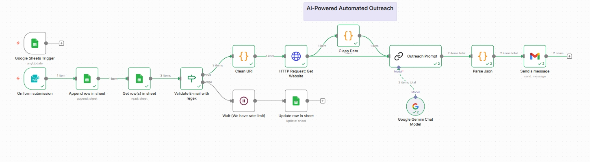

 # Ai_Automated Outreach Workflow

This project is an **Automated Outreach Workflow** designed to streamline outreach campaigns for leads, clients, or contacts. It can be triggered either by:

- **Form submissions** (e.g., Google Forms, Typeform)  
- **New entries in Google Sheets**  

Once triggered, the workflow can perform actions such as sending emails, WhatsApp messages, or integrating with other tools via API.

---

## Features

- **Flexible Triggers:** Works with both form submissions and manual Google Sheets entries.  
- **Automated Messaging:** Send personalized messages to leads automatically.  
- **Easy Integration:** Connects with popular tools like Gmail, WhatsApp APIs, Zapier, or Make.com.  
- **Trackable Workflow:** Logs all outreach activity in Google Sheets or your preferred database.  

---

## How to Use

1. **Setup Google Sheet**  
   - Create a sheet with columns like Name, Email, Phone, Message, Status.  

2. **Connect Workflow**  
   - If using form submission: Link your form responses to the workflow.  
   - If using manual Google Sheets input: The workflow will trigger whenever a new row is added.  

3. **Customize Messages**  
   - Define the template messages and variables for personalization (e.g., `{{Name}}`).  

4. **Run & Monitor**  
   - Trigger the workflow and monitor logs for sent messages and status updates.  

---

## Requirements

- Google Account with Sheets access  
- Access to the automation platform (e.g., n8n, Zapier, Make.com)  
- Optional: Messaging service API credentials (WhatsApp, Gmail, etc.)  

---

## Example Use Case

1. A new lead fills a Google Form.  
2. Workflow automatically logs the lead into Google Sheets.  
3. Personalized outreach message is sent to the lead via WhatsApp or Email.  
4. Status is updated in the Google Sheet for tracking.  

---

## Contributing

Feel free to fork the project, suggest improvements, or create your own integrations for different platforms.

---

## License

This project is open for personal and professional use. Please give credit if shared or reused.
